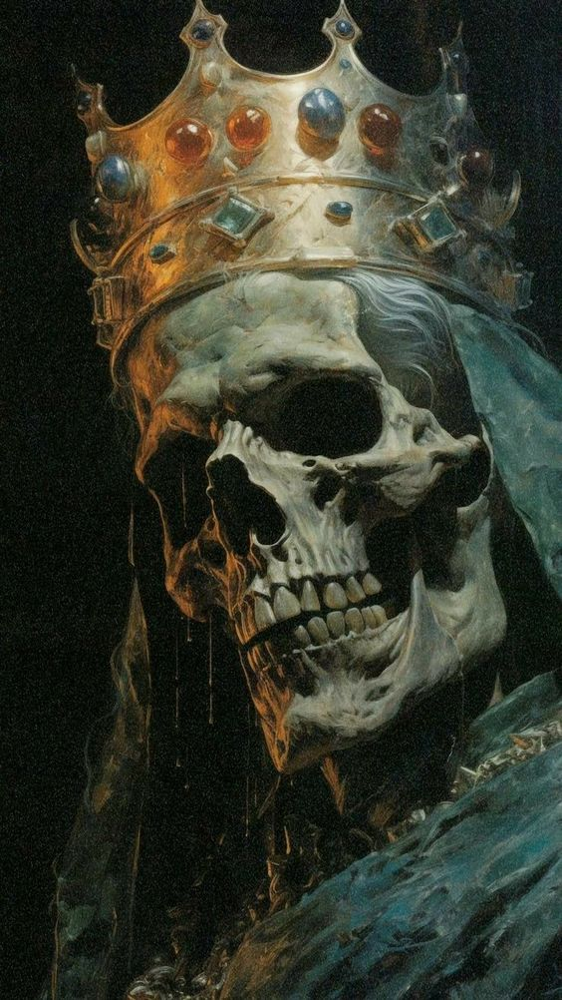

## 🗒 ASCII ART

## 🎯 Main Goal

It's just a fun project.
You can use it as a plugin for your webcam and have fun with your friends, you can also generate an ascii-image from the original image.

## ⚙️ Technical Dependencies

- C++ 20
- CMake >= 3.14
- OpenCV 4.10.0
- [TBF-L/standard-extended-cpp-lib](https://github.com/TBF-L/standard-extended-cpp-lib) (for performance testing)

## 🖥 Supported Systems

- [X] GNU/Linux (verified)
- [ ] Windows (not verified)

## ⚡️ Performance

|             Method                |  Image Size |  Iteration Count        | time (for all iterations) |
|:---------------------------------:|:-----------:|:-----------------------:|:-------------------------:|
| Convert_Image_To_Ascii            | 500x500     | 1'000                   |          ~88ms            |
| Get_Formatted_Output_Ascii_Image  | 500x500     | 1'000                   |          ~6591ms          |

## ⚒ Results

  
  

- You can also resize the output ascii image