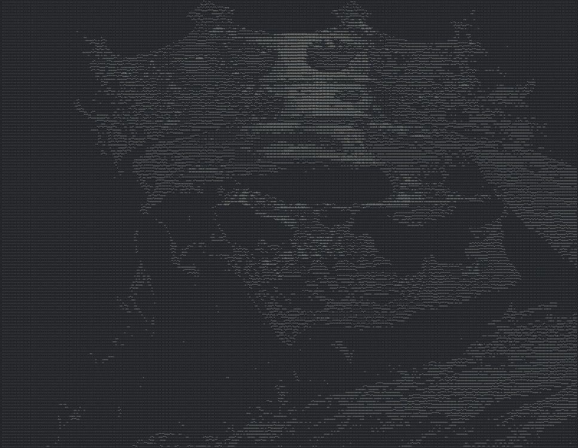

## 🗒 ASCII ART

## 🎯 Main Goal
It's just a fun project.
You can use it as a plugin for your webcam and have fun with your friends, you can also generate an ascii-image from the original image.

## ⚙️ Technical Dependencies
- C++ 20
- CMake >= 3.14
- OpenCV 4.10.0
- [TBF-L/standard-extended-cpp-lib](https://github.com/TBF-L/standard-extended-cpp-lib) (for performance testing)

## 🖥 Supported Systems 
- [X] GNU/Linux (verified)
- [ ] Windows (not verified)

## ⚡️ Performance 
- Coming soon...

## ⚒ Results

  
  

- You can also resize the output ascii image